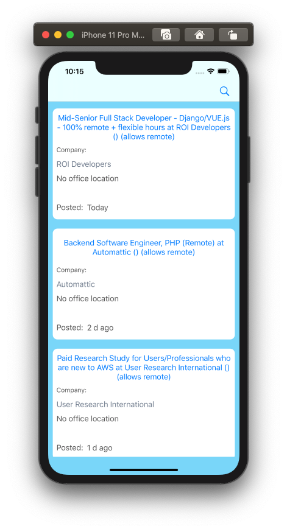
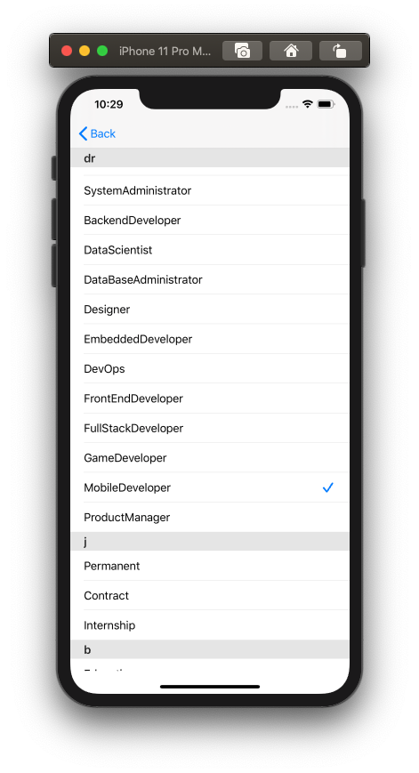
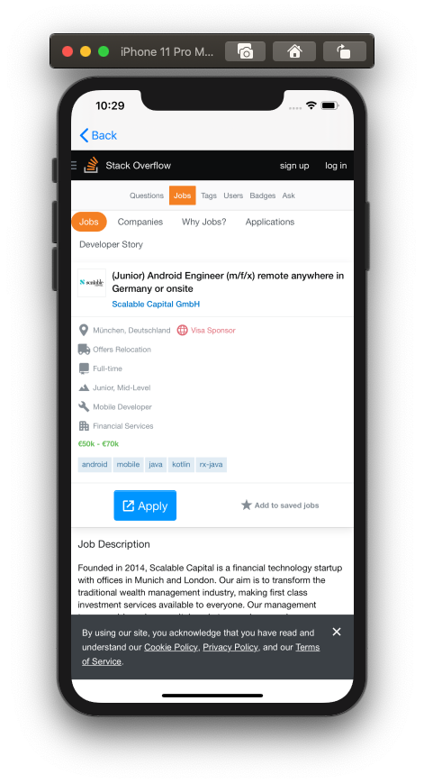

#  Jober Example App

This application is created for skill presentation purposes.
This application is intended to do next things: 
* looking for jobs on StackOverflow 

Application creates request to StackOverflow RSS feed API and receives data in XML format.  

In this application I didn't use any third party libraryies  

 

##License
---
This project, including its components and excluding works credited, is released under the Unlicense.
